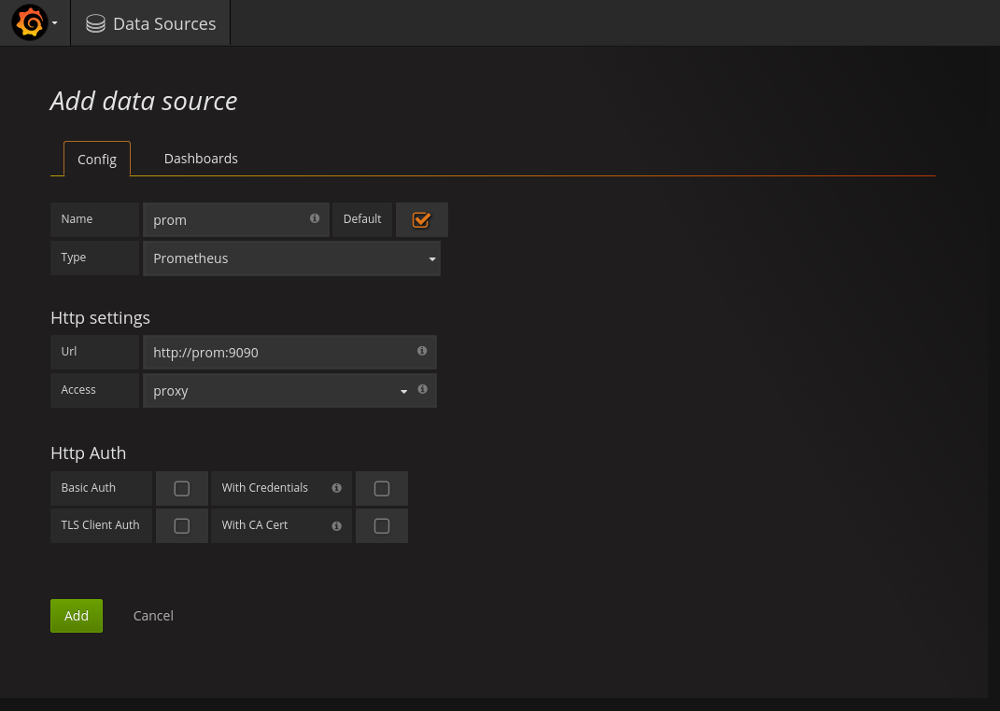
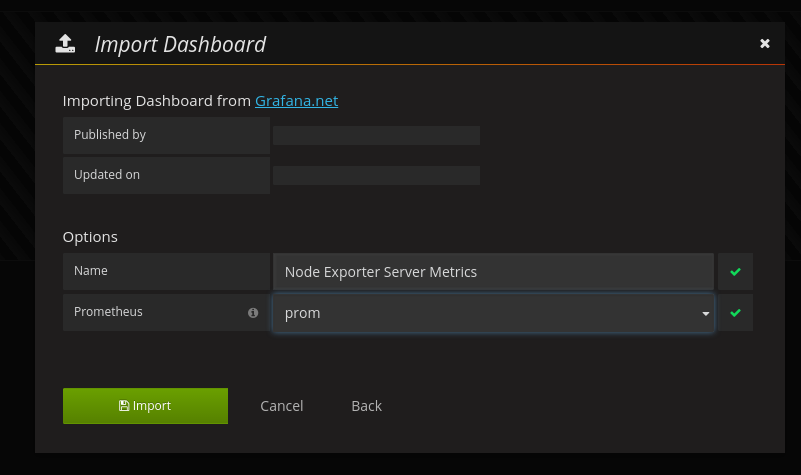
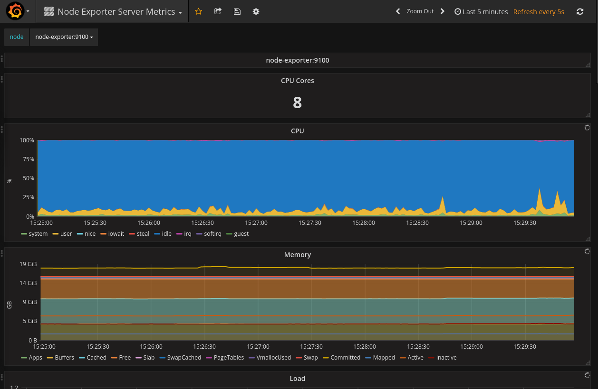
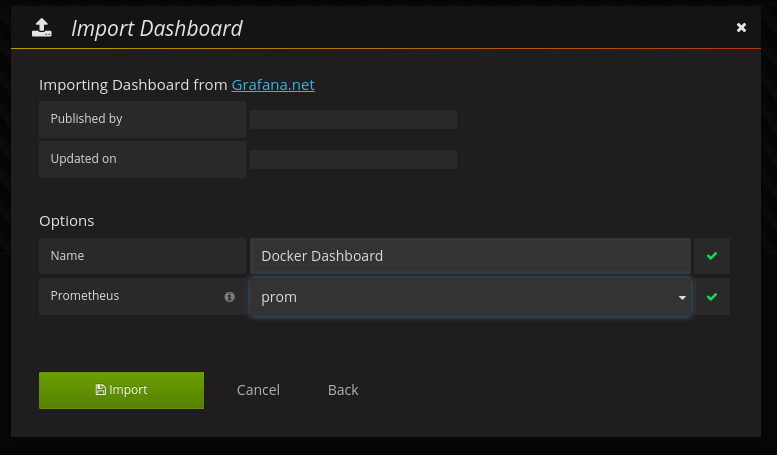
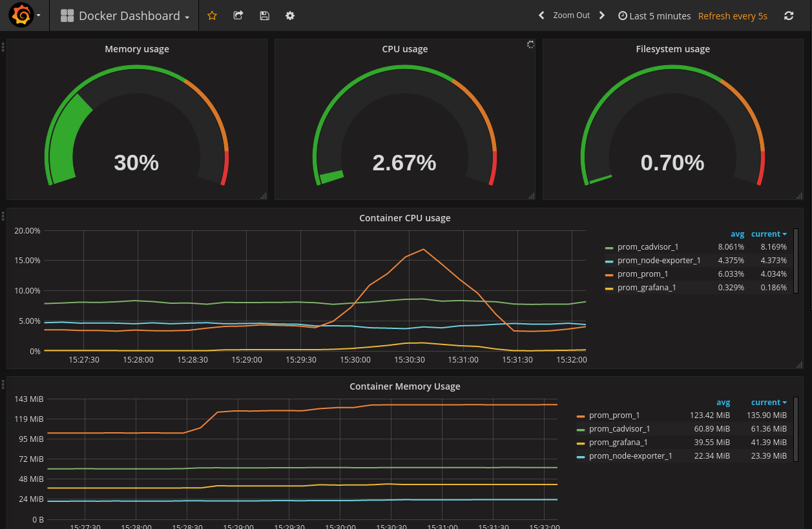

Prometheus - Grafana demo
=========================

Run
---

```
docker-compose up
```

Browse
------

### Prometheus

[http://localhost:9090](http://localhost:9090)

### Grafana

[http://localhost:3000](http://localhost:3000)

Setup
-----

Go to [Grafana](http://localhost:3000) and add Prometheus data source.

Default user/password is `admin/admin`

1. Add a datasource

    - Name: `prom`
    - Type: `Prometheus`
    - Url: `http://prom:9090` (inside the network created by docker-compose)
    - Access: `proxy` (Grafana try to access the resource inside the browser if
      direct, with proxy the grafana server do it)

    

1. Host dashboard

    - Go to `Dashboards/Import`
    - Upload json file `node-exporter-server-metrics_rev4.json`
    - Select `prom` as Prometheus

    

    

1. Docker dashboard

    - Go to `Dashboard/Import`
    - Upload json file `docker-dashboard_rev5.json`
    - Select `prom` as Prometheus

    

    

Details
-------

All components are loaded from the `docker-compose.yml`:

- [prometheus](https://prometheus.io/) to fetch all metrics
- [grafana](https://grafana.net/) to display your metrics
- [node-exporter](https://github.com/prometheus/node_exporter) to expose host
  metrics to prometheus
- [cadvisor](https://github.com/google/cadvisor) to expose docker metrics to
  prometheus


The static configuration of prometheus is in `config/prometheus.yml` and pull
metrics from `node-exporter` and `cadvisor` with an interval of `1s`.


